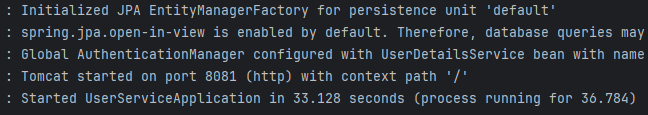

# SS_Assignment-UserService
This is the User Microservice

## Requirements:
To run the application, you will need the following:
* Eclipse/IntelliJ IDE
* JDK 17 and above
* MySQL

## Execution Instructions:
To run the application:
1. Start the MySQL database service and login to the mysql shell
2. In the shell, run the command to create the database
```
CREATE DATABASE userdb;
```
3. Once the orderdb database is created, open the application is Eclipse/IntelliJ IDE
4. In the Project files, open the `src/main/resources/application.properties` file and update the following properties:
```
spring.datasource.url=jdbc:mysql://localhost:3306/userdb?characterEncoding=UTF-8&useSSL=false&allowPublicKeyRetrieval=true
spring.datasource.username=?
spring.datasource.password=?
(Here, replace the `?` with your database credentials)
```
5. Once the application properties are set, run the `src/main/java/com/assignment/user/service/UserService/UserServiceApplication.java`
6. You should be able to see the following line in the console:



## Testing the app
To test the API endpoints, you can install Postman and use the following document for endpoints and screenshots:
[Project document](https://docs.google.com/document/d/1tWjFErH41nJ7-l1gak6Jtkh7fbZHqTYT7y07o2B18as/edit?usp=sharing)